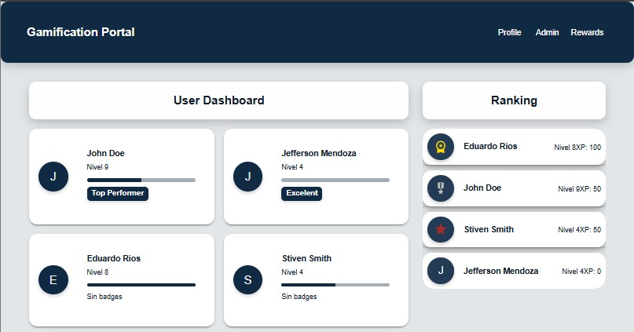
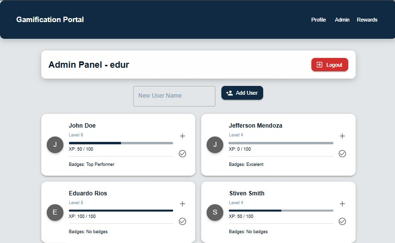

# 🎮 Gamification Portal - UI & Backend

🚀 **Gamification Portal** is an application that implements a gamification system where users can earn XP, unlock badges, and redeem rewards. Administrators can manage users and rewards.

---
<p align="center">
  
</p>

## 📌 **Main Features**
### **🧑‍💻 User Dashboard**
- Progress tracking with XP bar.
- Unlocking badges and achievements.
- Redeeming accumulated rewards.

### **🛠️ Admin Panel**
- Assigning XP to users.
- Managing badges and rewards.
- Viewing user progress.
<p align="center">
  
</p>

### **💾 Technologies Used**
- **Frontend:** React + TypeScript + Redux Toolkit + Material-UI (MUI).
- **Backend:** Flask + SQLAlchemy + JWT Authentication.
- **Database:** MySQL / MariaDB.

---

## 📸 **Project Preview**

<p align="center">
  
</p>
---

## 🛠️ **Installation and Setup**
### 🔹 **1. Clone Repositories**
```sh
git clone https://github.com/jemr12104/gamification-ui.git
git clone https://github.com/jemr12104/gamification-ui-backend.git
